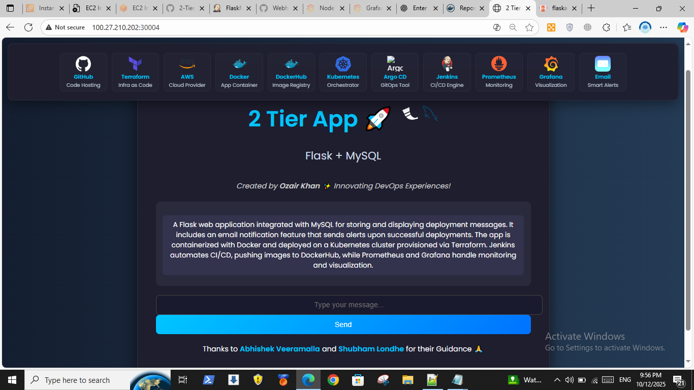
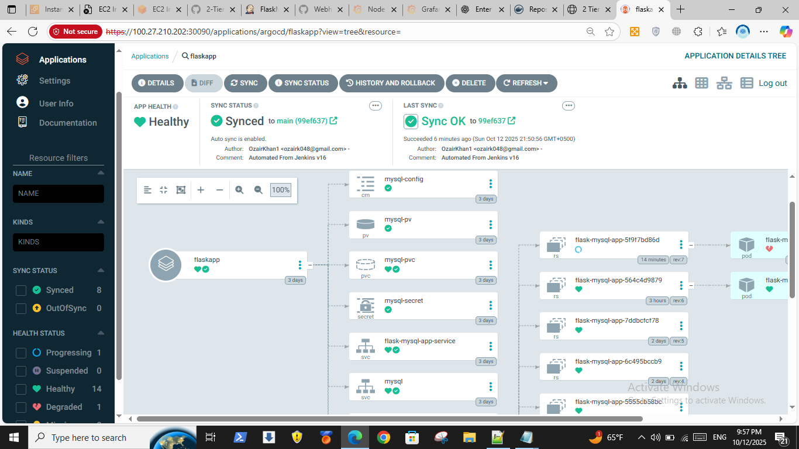
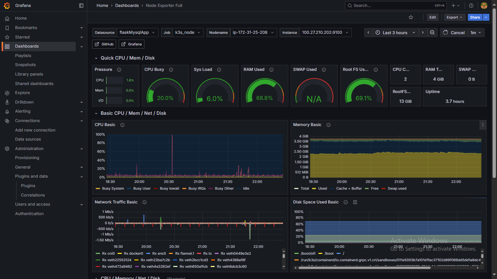

# 🚀 2-Tier DevOps Project – Flask + MySQL  

A complete **2-Tier Application** built with **Flask (Python)** for backend and frontend, **MySQL** for the database, styled with **HTML, CSS, and Bootstrap**, and enhanced with **JavaScript**.  
Containerized with **Docker**, deployed on **AWS**, and automated using modern **DevOps tools** such as **Terraform, Jenkins, and ArgoCD**.

This project demonstrates end-to-end **CI/CD, GitOps, Infrastructure as Code (IaC), and Kubernetes orchestration** – a hands-on showcase of cloud-native DevOps.  

---

## 📌 Project Overview  

- **Application Layer (Tier 1):** Flask Web Application (Python)  
- **Database Layer (Tier 2):** MySQL Database  
- **Automation & Cloud:** Docker, Kubernetes (k3s), Jenkins, Argo CD, Terraform, AWS  

The project follows a **GitOps-driven workflow**, where every change in GitHub is automatically built, tested, deployed, and monitored.  

---

## 🛠 Tools & Technologies  

  
  
  
  
  
  
  
  
  

**Stack Breakdown**  
- **GitHub + Webhooks:** Source Code Hosting & Version Control  
- **Jenkins (with Shared Libraries):** CI/CD Automation Engine  
- **Docker + DockerHub:** Containerization & Image Registry  
- **Kubernetes (k3s):** Cluster Orchestration  
- **Argo CD:** GitOps Continuous Delivery  
- **Terraform:** Infrastructure as Code  
- **AWS:** Cloud Infrastructure Provider  
- **Email Integration:** Smart Alerts & Notifications  

---

## ⚙️ Key Features  

- ✅ Flask web application with MySQL backend  
- ✅ Dockerized and published to DockerHub  
- ✅ Jenkins pipeline for continuous integration and delivery  
- ✅ Kubernetes (k3s) deployment for scalability and resilience  
- ✅ GitOps workflow powered by Argo CD  
- ✅ Infrastructure managed via Terraform on AWS  
- ✅ Prometheus for application and infrastructure monitoring  
- ✅ Grafana for real-time visualization and dashboards  
- ✅ Email notifications for deployment & monitoring alerts  
 

---

## 🔄 Workflow  

1. **Terraform provisions AWS infrastructure** → Creates EC2 instances, security groups, and networking setup  
2. **Jenkins pipeline triggers** → Builds Flask app, runs tests, and creates Docker image  
3. **Docker image pushed to DockerHub** → Stores versioned application containers  
4. **Kubernetes (k3s) cluster deploys application** → Using manifests stored in GitHub  
5. **Argo CD performs GitOps sync** → Continuously reconciles the Git state with the live cluster  
6. **Prometheus collects metrics** → Monitors application and infrastructure performance  
7. **Grafana visualizes metrics** → Displays dashboards and trends in real time  
8. **Email notifications sent** → Alerts on successful deployments or monitoring thresholds  

---

**Flask-MySQL App**  
  

**ArgoCd Setup**    
  
  
**Grafana Dashboard**   
  

